# Machine Learning with R

## [Supervised Learning Algorithms](#supervised-learning-algorithms)
* [Nearest Neighbor Classification](#nearest-neighbor-classification)
* [Naive Bayes Classification](#naive-bayes-classification)
* [Decision Trees Classification](#decision-trees-classification)
* [Linear Regression Numeric prediction](#linear-regression-numeric-prediction)
* [Regression Trees Numeric prediction](#regression-trees-numeric-prediction)
* [Neural Networks](#neural-networks)
* [Support Vector Machines](#support-vector-machines)

## [Unsupervised Learning Algorithms](#unsupervised-learning-algorithms)
* [Association Rules Pattern detection](#association-rules-pattern-detection)
* [k-means clustering](#k-means-clustering)

## [Meta-Learning Algorithms](#meta-learning-algorithms)
* [Bagging Dual use](#bagging-dual-use)
* [Boosting Dual use](#boosting-dual-use)
* [Random Forests Dual use](#random-forests-dual-use)

## Supervised Learning Algorithms
### [Nearest Neighbor Classification](https://github.com/kvinlazy/ML_R/blob/master/test_knn.R)

####  Nearest neighbor classifiers are defined by their characteristic of classifying unlabeled examples by assigning them the class of similar labeled examples. Despite the simplicity of this idea, nearest neighbor methods are extremely powerful.
<table>
  <tr>
    <th>Strengths</th>
    <th>Weaknesses</th>
  </tr>
  <tr>
    <td>Simple and effective</td>
    <td>Does not produce a model, limiting the ability to understand how the features are related to the class</td>
  </tr>
   <tr>
    <td> Makes no assumptions about the underlying data distribution</td>
    <td>Requires selection of an appropriate k</td>
  </tr>
  <tr>
    <td> Fast training phase</td>
    <td>Slow classification phase</td>
  </tr>
  <tr>
    <td> </td>
    <td>Nominal features and missing data require additional processing</td>
  </tr>
</table>

##### Diagnosing Breast Cancer
<table>
    <tr>
      <th></th>
      <th> wbcd_test_pred </th>
      <th></th>
      <th></th>
    </tr>
    <tr>
        <td>wbcd_test_labels</td>
        <td>Benign </td>
        <td>Malignant</td>
        <td>Row Total</td>
    </tr>
    <tr>
        <td>Benign</td>
        <td> 77 </td>
        <td>0</td>
        <td> 77</td>
    </tr>
    <tr>
        <td></td>
        <td> 1.000 </td>
        <td>0.000</td>
        <td> 0.770</td>
    </tr>
     <tr>
        <td></td>
        <td>  0.975 </td>
        <td>0.000</td>
        <td> </td>
    </tr>
     <tr>
        <td></td>
        <td>   0.770  </td>
        <td>0.000</td>
        <td> </td>
    </tr>
    <tr>
        <td>Malignant</td>
        <td>  2  </td>
        <td>21</td>
        <td>23 </td>
    </tr>
    <tr>
        <td></td>
        <td>  0.087 </td>
        <td>0.913</td>
        <td>0.230  </td>
    </tr>
    <tr>
        <td></td>
        <td> 0.025 </td>
        <td>1.000</td>
        <td>  </td>
    </tr>
    <tr>
        <td></td>
        <td>  0.020  </td>
        <td> 0.210</td>
        <td>  </td>
    </tr>
    <tr>
        <td>Column Total</td>
        <td>  79 </td>
        <td> 21</td>
        <td> 100  </td>
    </tr>
    <tr>
        <td></td>
        <td> 0.790  </td>
        <td> 0.210</td>
        <td>  0.210 </td>
    </tr>
  </table>

### [Naive Bayes Classification](https://github.com/kvinlazy/ML_R/blob/master/test.R)

#### The technique descended from the work of the 18th century mathematician Thomas Bayes, who developed foundational principles to describe the probability of events, and how probabilities should be revised in the light of additional information. These principles formed the foundation for what are now known as Bayesian methods.
<table>
  <tr>
    <th>Strengths</th>
    <th>Weaknesses</th>
  </tr>
  <tr>
    <td>Simple, fast, and very effective</td>
    <td>Relies on an often-faulty assumption of equally important and independent features</td>
  </tr>
  <tr>
    <td>Does well with noisy and missing data</td>
    <td>Not ideal for datasets with many numeric features</td>
    </tr>
  <tr>
    <td> Requires relatively few examples for training, but also works well with very large numbers of examples</td>
    <td>Estimated probabilities are less reliable than the predicted classes</td>
  </tr>
  <tr>
    <td>Easy to obtain the estimated probability for a prediction </td>
    <td></td>
  </tr>
</table>
      
##### Filtering Mobile Phone Spam 
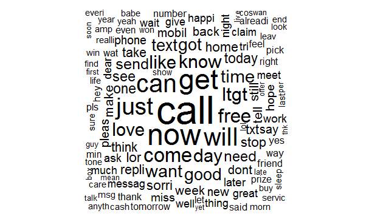

 
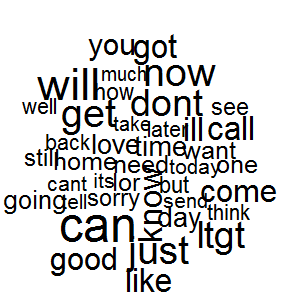

### [Decision Trees Classification](https://github.com/kvinlazy/ML_R/blob/master/test_c50.R)

#### Decision tree learners are powerful classifiers, which utilize a tree structure to model the relationships among the features and the potential outcomes.
### C5.0 Algorithm
<table>
  <tr>
    <th> Strengths</th>
    <th> Weaknesses</th>
  </tr>
  <tr>
    <td>An all-purpose classifier that does well on most problems</td>
    <td>Decision tree models are often biased toward splits on features having a large number of levels</td>
  </tr>
    <tr>
    <td>Highly automatic learning process, which can handle numeric or nominal features, as well as missing data</td>
    <td>It is easy to overfit or underfit the model</td>
  </tr>
  <tr>
    <td>Excludes unimportant features</td>
    <td>Can have trouble modeling some relationships due to reliance on axis-parallel splits</td>
  </tr>
  <tr>
    <td>Can be used on both small and large datasets</td>
    <td>Small changes in the training data can result in large changes to decision logic</td>
  </tr>
  <tr>
    <td>Results in a model that can be interpreted without a mathematical background (for relatively small trees)</td>
    <td>Large trees can be difficult to interpret and the decisions they make may seem counterintuitive</td>
  </tr>
  <tr>
    <td>More efficient than other complex models</td>
    <td></td>
  </tr>
 </table>

##### Identifying Risky Bank Loans
###### Trail 10
<table>
  <tr>
    <th></th>
    <th>predicted default</th>
    <th></th>
    <th></th>
  </tr>
  <tr>
    <th>actual default</th>
    <th>1</th>
    <th>2</th>
    <th>Row Total</th>
  </tr>
  <tr>
    <td>1</td>
    <td> 57</td>
    <td>10</td>
    <td>67</td>
  </tr>
  <tr>
    <td></td>
    <td>0.57</td>
    <td>0.10</td>
    <td></td>
  </tr>
  <tr>
    <td>2</td>
    <td>17</td>
    <td>16</td>
    <td>33</td>
  </tr>
  <tr>
    <td></td>
    <td>0.17</td>
    <td>0.16</td>
    <td></td>
  </tr>
   <tr>
    <td>Column Total</td>
    <td>74</td>
    <td>26</td>
    <td>100</td>
  </tr>
</table>
 
###### Trial 9
<table>
  <tr>
    <th></th>
    <th>predicted default</th>
    <th></th>
    <th></th>
  </tr>
  <tr>
    <th>actual default</th>
    <th>1</th>
    <th>2</th>
    <th>Row Total</th>
  </tr>
  <tr>
    <td>1</td>
    <td>60</td>
    <td>7</td>
    <td>67</td>
  </tr>
  <tr>
    <td></td>
    <td>0.60</td>
    <td>0.07</td>
    <td></td>
  </tr>
  <tr>
    <td>2</td>
    <td>19</td>
    <td>14</td>
    <td>33</td>
  </tr>
  <tr>
    <td></td>
    <td>0.19</td>
    <td>0.14</td>
    <td></td>
  </tr>
   <tr>
    <td>Column Total</td>
    <td>79</td>
    <td>21</td>
    <td>100</td>
  </tr>
</table>

### Ripper Algorithm
<table>
  <tr>
    <th> Strengths</th>
    <th> Weaknesses</th>
  </tr>
  <tr>
    <td>Generates easy-to-understand, human-readable rules</td>
    <td>May result in rules that seem to defy common sense or expert knowledge</td>
  </tr>
    <tr>
    <td>Efficient on large and noisy datasets</td>
    <td>Not ideal for working with numeric data</td>
  </tr>
  <tr>
    <td>Generally produces a simpler model than a comparable decision tree</td>
    <td>Might not perform as well as more complex models</td>
  </tr>
 </table>
 
##### Identifying Poisonous Mushrooms

###### === Summary ===
###### Correctly Classified Instances        8004               98.5229 %
###### Incorrectly Classified Instances       120                1.4771 %
###### Kappa statistic                          0.9704
###### Mean absolute error                      0.0148
###### Root mean squared error                  0.1215
###### Relative absolute error                  2.958  %
###### Root relative squared error             24.323  %
###### Total Number of Instances             8124    
###### Number of Rules : 9

### [Linear Regression Numeric prediction](https://github.com/kvinlazy/ML_R/blob/master/test_linear.R)
#### Regression is concerned with specifying the relationship between a single numeric dependent variable (the value to be predicted) and one or more numeric independent variables (the predictors).
### Multi Linear Regression 
<table>
  <tr>
    <th> Strengths</th>
    <th> Weaknesses</th>
  </tr>
  <tr>
    <td>By far the most common approach for modeling numeric data</td>
    <td>Makes strong assumptions about the data</td>
  </tr>
    <tr>
    <td>Can be adapted to model almost any modeling task</td>
    <td>The model's form must be specified by the user in advance</td>
  </tr>
  <tr>
    <td>Provides estimates of both the strength and size of the relationships among features and the outcome</td>
    <td>Only works with numeric features, so categorical data requires extra processing</td>
  </tr>
 </table>

##### Predicting Medical Expenses
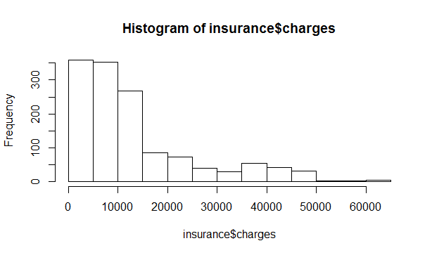

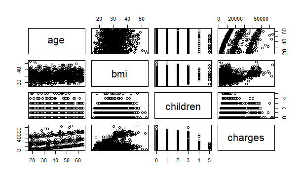

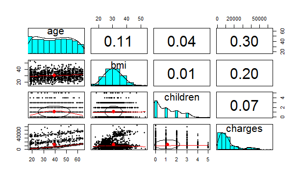

### [Regression Trees Numeric prediction](https://github.com/kvinlazy/ML_R/blob/master/test_cortree.R)
<table>
  <tr>
    <th> Strengths</th>
    <th> Weaknesses</th>
  </tr>
  <tr>
    <td>Combines the strengths of decision trees with the ability to model numeric data</td>
    <td>Not as well-known as linear regression</td>
  </tr>
    <tr>
    <td>Does not require the user to specify the model in advance</td>
    <td>Requires a large amount of training data</td>
  </tr>
  <tr>
    <td>Uses automatic feature selection, which allows the approach to be used with a very large number of features</td>
    <td>Difficult to determine the overall net effect of individual features on the outcome</td>
  </tr>
  <tr>
    <td>May fit some types of data much better than linear regression</td>
    <td>Large trees can become more difficult to interpret than a regression model</td>
  </tr>
 </table>
 
##### Estimating the Quality of Wines
 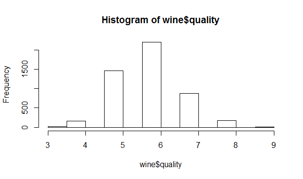
 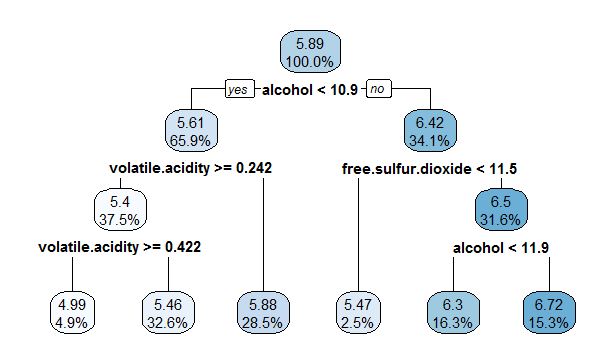
 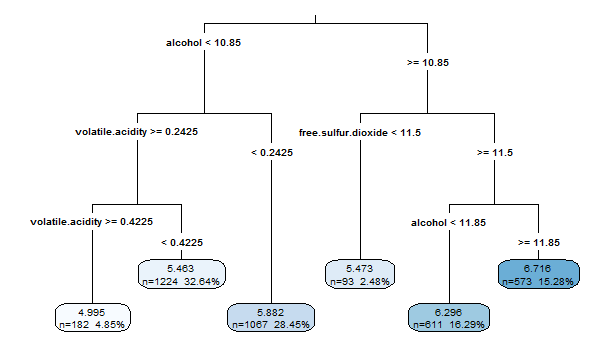
 
### [Neural Networks](https://github.com/kvinlazy/ML_R/blob/master/test_neutralnet.R)
#### An Artificial Neural Network (ANN) models the relationship between a set of input signals and an output signal using a model derived from our understanding of how a biological brain responds to stimuli from sensory inputs.
<table>
  <tr>
    <th> Strengths</th>
    <th> Weaknesses</th>
  </tr>
  <tr>
    <td>Can be adapted to classification or numeric prediction problems</td>
    <td>Extremely computationally intensive and slow to train, particularly if the network topology is complex</td>
  </tr>
    <tr>
    <td>Capable of modeling more complex patterns than nearly any algorithm</td>
    <td>Very prone to overfitting training data</td>
  </tr>
  <tr>
    <td>Makes few assumptions about the data's underlying relationships</td>
    <td>Results in a complex black box model that is difficult, if not impossible, to interpret</td>
  </tr>
 </table>
 
##### Modeling the strength of concrete
##### Train model
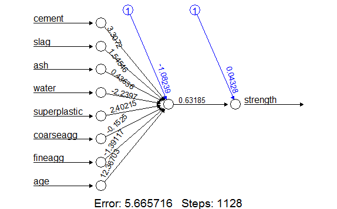
##### Improved model
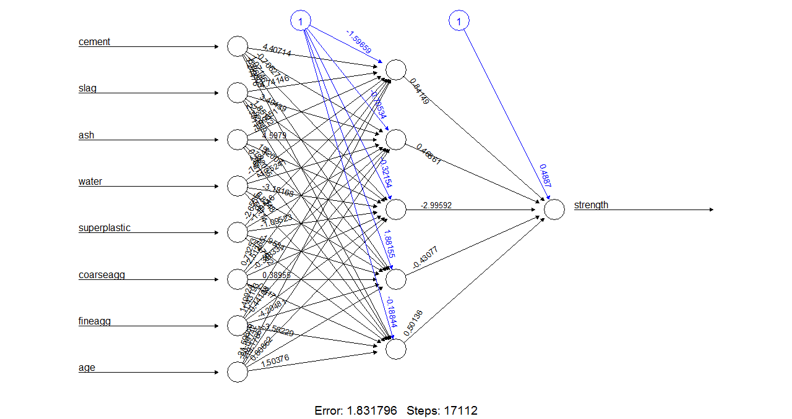
### [Support Vector Machines](https://github.com/kvinlazy/ML_R/blob/master/test_OCR.R)
#### A Support Vector Machine (SVM) can be imagined as a surface that creates a boundary between points of data plotted in multidimensional that represent examples and their feature values.
<table>
  <tr>
    <th> Strengths</th>
    <th> Weaknesses</th>
  </tr>
  <tr>
    <td>Can be used for classification or numeric prediction problems</td>
    <td>Finding the best model requires testing of various combinations of kernels and model parameters</td>
  </tr>
    <tr>
    <td>Not overly influenced by noisy data and not very prone to overfitting</td>
    <td>Can be slow to train, particularly if the input dataset has a large number of features or examples</td>
  </tr>
  <tr>
    <td>May be easier to use than neural networks, particularly due to the existence of several well-supported SVM algorithms</td>
    <td>Results in a complex black box model that is difficult, if not impossible, to interpret</td>
  </tr>
 </table>
 
##### Performing OCR

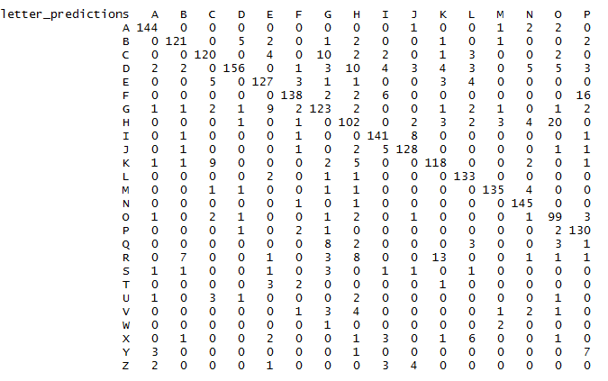

<table>
  <tr>
    <th>Train data result</th>
    <th> </th>
  </tr>
   <tr>
    <th>False</th>
    <th>True</th>
  </tr>
  <tr>
    <td>0.16075</td>
    <td> 0.83925</td>
  </tr>
    <tr>
    <th>Improved Data</th>
    <th></th>
  </tr>
  <tr>
    <td>0.0695</td>
    <td>0.9305</td>
  </tr>
 </table>
 
## Unsupervised Learning Algorithms
### [Association Rules Pattern detection](https://github.com/kvinlazy/ML_R/blob/master/test_aprori.R)
#### Much work has been done to identify heuristic algorithms for reducing the number of itemsets to search. Perhaps the most-widely used approach for efficiently searching large databases for rules is known as Apriori. Introduced in 1994 by Rakesh Agrawal and Ramakrishnan Srikant, the Apriori algorithm has since become somewhat synonymous with association rule learning.
<table>
  <tr>
    <th> Strengths</th>
    <th> Weaknesses</th>
  </tr>
  <tr>
    <td>Is capable of working with large amounts of transactional data</td>
    <td>Not very helpful for small datasets</td>
  </tr>
    <tr>
    <td>Results in rules that are easy to understand</td>
    <td>Requires effort to separate the true insight from common sense</td>
  </tr>
  <tr>
    <td>Useful for "data mining" and discovering unexpected knowledge in databases</td>
    <td>Easy to draw spurious conclusions from random patterns</td>
  </tr>
 </table>
 
##### Identifying Frequently Purchased Groceries
 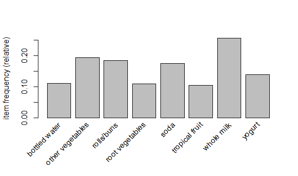
 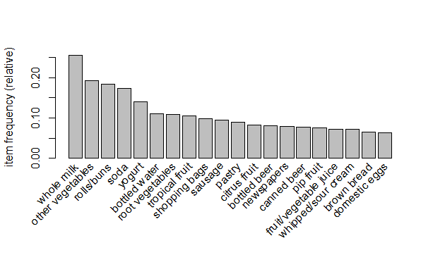
 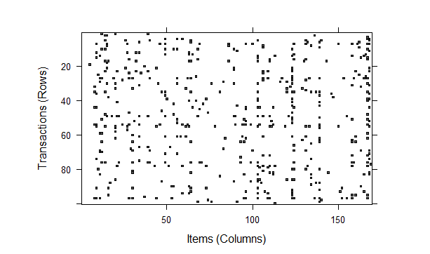
 <table>
  <tr>
    <th> LHS</th>
    <th> RHS</th>
    <th> Support</th>
    <th> Confidence</th>
    <th> Lift</th>
    <th> Count</th>
  </tr>
  <tr>
    <td>{herbs} </td>
    <td>=> {root vegetables}</td>
    <td>0.007015760</td>
    <td>0.4312500   </td>
    <td>3.956477 </td>
    <td> 69</td>
  </tr>
    <tr>
    <td>{berries}</td>
    <td>=> {whipped/sour cream}</td>
    <td>0.009049314  </td>
    <td>0.2721713  </td>
    <td>3.796886 </td>
    <td>    89</td>
  </tr>
  <tr>
    <td>{other vegetables, tropical fruit, whole milk}</td>
    <td>=> {root vegetables} </td>
    <td>   0.007015760 </td>
    <td> 0.4107143</td>
    <td> 3.768074</td>
    <td> 69</td>
  </tr>
 </table>
 
### [k-means clustering](https://github.com/kvinlazy/ML_R/blob/master/test_k.R)
#### Clustering is an unsupervised machine learning task that automatically divides the data into clusters, or groups of similar items. The k-means algorithm is perhaps the most commonly used clustering method.
<table>
  <tr>
    <th> Strengths</th>
    <th> Weaknesses</th>
  </tr>
  <tr>
    <td>Uses simple principles that can be explained in non-statistical terms</td>
    <td>Not as sophisticated as more modern clustering algorithms</td>
  </tr>
  <tr>
    <td>Highly flexible, and can be adapted with simple adjustments to address nearly all of its shortcomings</td>
    <td>Because it uses an element of random chance, it is not guaranteed to find the optimal set of clusters</td>
  </tr>
  <tr>
    <td>Performs well enough under many real-world use cases</td>
    <td>Requires a reasonable guess as to how many clusters naturally exist in the data</td>
  </tr>
   <tr>
    <td></td>
    <td>Not ideal for non-spherical clusters or clusters of widely varying density</td>
  </tr>
 </table>
 
##### Finding Teen Market Segments
 
 
 

## Meta-Learning Algorithms
### Bagging Dual use
#### As described by Leo Breiman in 1994, bagging generates a number of training datasets by bootstrap sampling the original training data. These datasets are then used to generate a set of models using a single learning algorithm.
### Boosting Dual use
#### A method that boosts the performance of weak learners to attain the performance of stronger learners is called booting.
### Random Forests Dual use
#### This method is combination of the base principles of bagging with random feature selection to add additional diversity to the decision tree models.
<table>
  <tr>
    <th> Strengths</th>
    <th> Weaknesses</th>
  </tr>
  <tr>
    <td>An all-purpose model that performs well on most problems</td>
    <td>Unlike a decision tree, the model is not easily interpretable</td>
  </tr>
  <tr>
    <td>Can handle noisy or missing data as well as categorical or continuous features </td>
    <td>May require some work to tune the model to the data</td>
  </tr>
  <tr>
    <td>Selects only the most important features</td>
    <td></td>
  </tr>
   <tr>
    <td>Can be used on data with an extremely large number of features or examples</td>
    <td></td>
  </tr>
 </table>

Reference: 
Machine Learning with R
Lantz, Brett. Machine learning with R. Packt Publishing Ltd, 2013.
